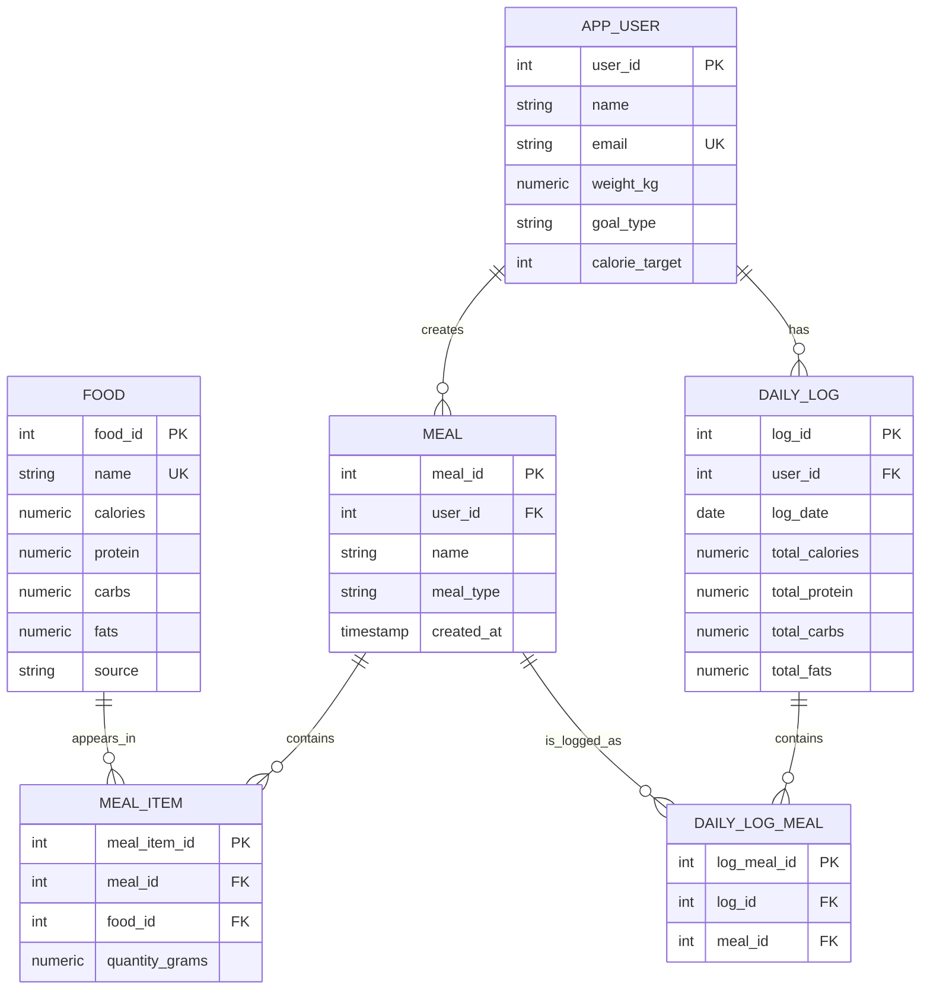

# E/R model

This implementation follows the FitMeal Planner project idea: users search foods, create meals, and track calories/macronutrients.

The relation name `app_user` is used instead of `User` because `user` is a reserved/awkward SQL identifier in PostgreSQL.

## Mapping from the presentation diagram

The original presentation diagram contains the core entities `User`, `Food`, `Meal`, `MealItem`, and `Daily_Log`. This implementation keeps those core entities and adds `Daily_Log_Meal` as a bridge relation, because a daily log can contain many meals and the same meal can appear in many daily logs.

## SQL features demonstrated

- `SELECT`: food search, meal nutrition, daily dashboard
- `INSERT`: create meals, add foods to meals, create daily logs, log meals
- `DELETE`: remove meal items and logged meals
- Views: `meal_nutrition`, `daily_log_summary`
- Trigger: refreshes stored `daily_log.total_*` columns when meals are logged/unlogged
- Regular expression matching: Python route parses food search syntax such as `protein>=20 calories<300`
